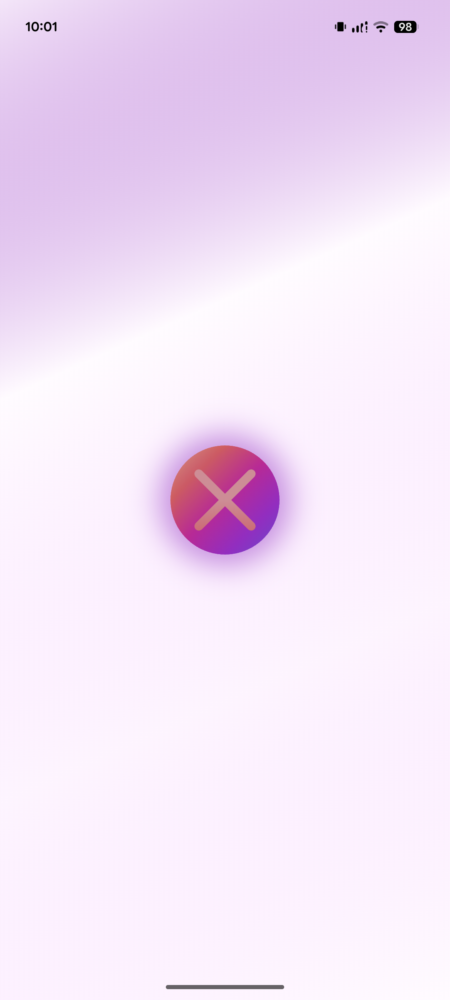
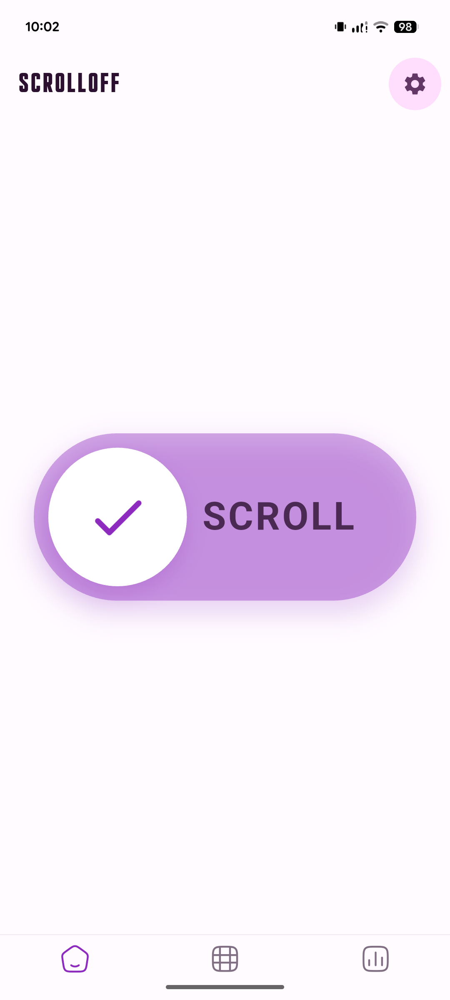
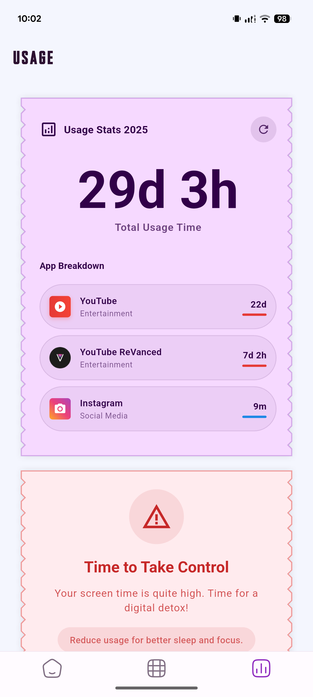

# 🚀 scrolloff

<p align="center">
  
</p>

[](https://flutter.dev/)
[](LICENSE)
[](CONTRIBUTING.md)

A beautiful, modern Flutter application designed for smooth scrolling experiences and stunning UI.

---

## ✨ Features

- ⚡️ **Smooth & Customizable Scrolling**
- 🎨 **Modern, Responsive UI**
- 📱 **Cross-platform: Android, iOS, Web**
- 🔥 **Easy to Extend & Customize**
- 🛠️ **Built with Latest Flutter Best Practices**

---

## 📸 Screenshots

<div align="center">
  
  ### 🚀 App Journey
  
  <table>
    <tr>
      <td align="center">
        
        <br><strong>🎭 Splash Screen</strong>
        <br><em>Animated welcome experience</em>
      </td>
      <td align="center">
        
        <br><strong>🏠 Home Dashboard</strong>
        <br><em>Your habit command center</em>
      </td>
      <td align="center">
        
        <br><strong>📊 Progress Tracking</strong>
        <br><em>Visual analytics & insights</em>
      </td>
    </tr>
  </table>
  
  <table>
    <tr>
      <td align="center">
        
        <br><strong>➕ Add apps</strong>
        <br><em>Create new habits easily</em>
      </td>
      <td align="center">
        
        <br><strong>📅 History View</strong>
        <br><em>Track your journey over time</em>
      </td>
    </tr>
  </table>
  
</div>


---

## 🚀 Getting Started

### Prerequisites

- [Flutter SDK](https://flutter.dev/docs/get-started/install)
- Android Studio / VS Code / Xcode

### Installation

```bash
git clone https://github.com/yourusername/scrolloff.git
cd scrolloff
flutter pub get
flutter run
```

---

## 📂 Project Structure

```
scrolloff/
 ├── lib/
 ├── assets/
 ├── test/
 └── ...
```

---

## 🤝 Contributing

Contributions, issues and feature requests are welcome!  
Feel free to check [issues page](https://github.com/yourusername/scrolloff/issues) or submit a pull request.

1. Fork the repo
2. Create your feature branch (`git checkout -b feature/AmazingFeature`)
3. Commit your changes (`git commit -m 'Add some AmazingFeature'`)
4. Push to the branch (`git push origin feature/AmazingFeature`)
5. Open a Pull Request

---

## 📄 License

This project is [MIT](LICENSE) licensed.

---

## 🙏 Acknowledgements

- [Flutter Documentation](https://docs.flutter.dev/)
- [Awesome Flutter](https://github.com/Solido/awesome-flutter)

---

> Made with ❤️ by [Sanjay](https://github.com/sanjay434343/ScrollOff)
